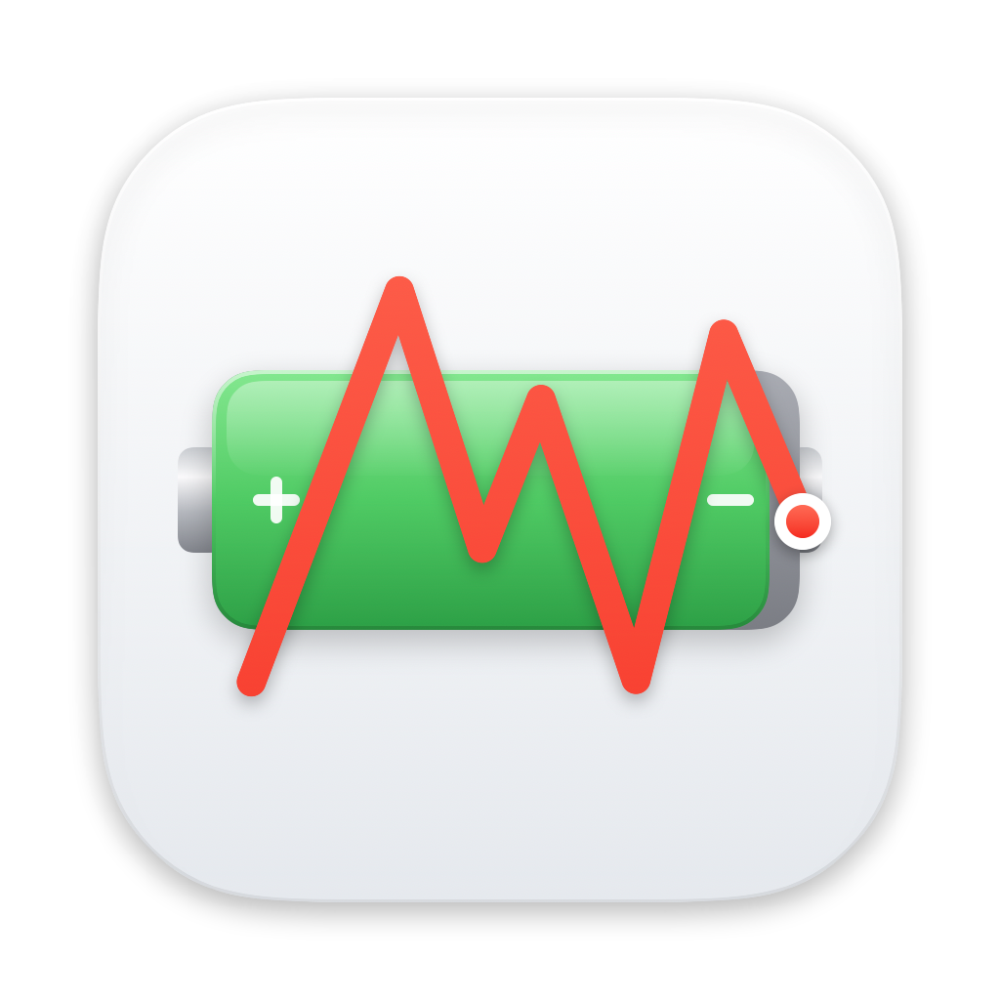
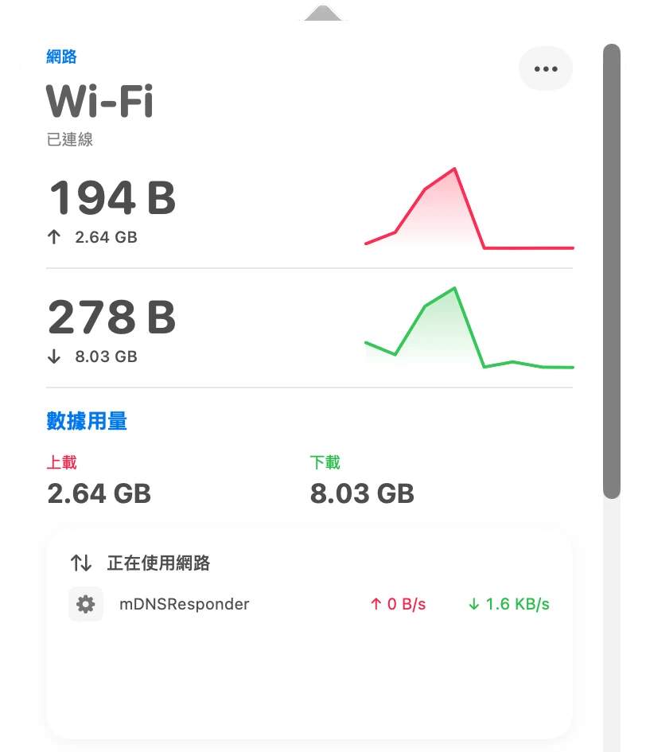
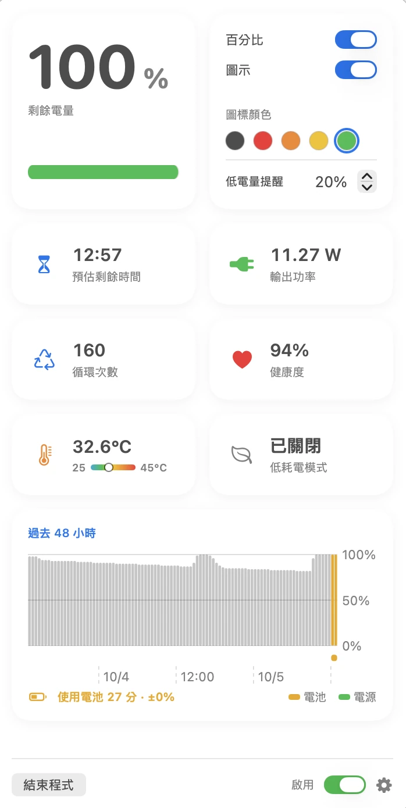
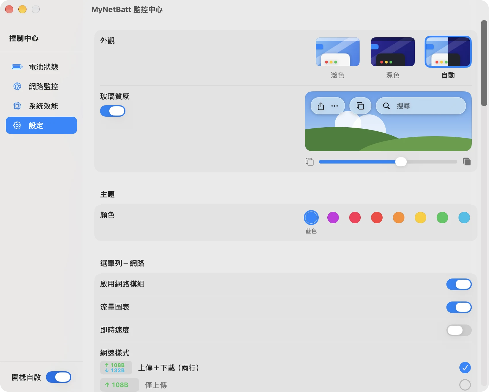

# MyNetBatt

<p align="center">
  <a href="README.md">繁體中文</a> · <strong>English</strong>
</p>

<p align="center">
  
</p>

MyNetBatt is a native macOS menu bar system monitor that brings battery, network, and system performance information together in a clean SwiftUI interface.

> Current version: 3.7 · Interface language: Traditional Chinese

For release highlights and fixes, see the [changelog](CHANGELOG.en.md) or [GitHub Releases](https://github.com/stone5202/MyNetBatt/releases). The changelog is also available in [Traditional Chinese](CHANGELOG.md).

## Screenshots

<p align="center">
  
  &nbsp;
  
</p>

<p align="center">
  Network & system monitoring · Battery health & power monitoring
</p>

<p align="center">
  
</p>

<p align="center">
  
</p>

<p align="center">
  Menu bar items · Settings
</p>

## Project status

MyNetBatt is under active development and maintenance. Its complete source code is available under the MIT License, and community bug reports, feature suggestions, and pull requests are welcome.

- Native Swift and SwiftUI macOS application
- Primarily developed and tested on Apple Silicon
- Includes an Xcode project for local builds
- Includes a Privileged Helper designed around signature validation and least privilege
- Processes and stores most monitoring data locally, with no analytics, advertising, or user-tracking SDKs

## Features

- Battery icon, percentage, real-time network speed, and traffic chart in the menu bar; six network speed styles (two lines, single line, upload only, download only, combined, speed with today's usage) picked from live previews in Settings
- Optional CPU, memory, and storage usage items in the menu bar
- Battery level, charging state, health, cycle count, temperature, power, and charge duration; the 48-hour chart is coloured by power source and marks charging and on-battery periods
- Daily log of battery health and cycle count, viewable over 30 days, 90 days, 1 year, or all time with a day-by-day list
- Low battery and fully charged notifications
- macOS Low Power Mode control through a signed Privileged Helper
- Upload and download speeds, average speed, cumulative traffic, today's hourly usage, interface, local IP, gateway, DNS, and public IP details
- Wi-Fi channel, signal strength, transmit rate, and security
- Daily, weekly, monthly, and yearly network usage per app (helpers and other child processes count towards the app that owns them, and other processes can optionally be listed separately), with upload and download counted separately and a history chart; tracking can be paused
- Live list of apps currently using the network
- Always-on-top float window that can be toggled with a global shortcut
- Configurable sections in the network and battery popovers
- CPU, GPU, memory (including memory pressure), swap, and storage monitoring, with an eject button for external volumes
- Thunderbolt, USB4, and USB device information
- Theme (auto, light, dark) and accent color
- Automatic monitoring refresh after waking from sleep
- Launch-at-login support

## Requirements

- macOS 26.5 or later
- Apple Silicon Mac (the project is currently developed and tested on `arm64`)
- Xcode 26 or later

## Building from source

1. Clone the repository:

   ```bash
   git clone https://github.com/stone5202/MyNetBatt.git
   cd MyNetBatt
   ```

2. Open the project in Xcode:

   ```bash
   open MyNetBatt/MyNetBatt.xcodeproj
   ```

3. Select your Development Team for the `MyNetBatt` and `MyNetBattPrivilegedHelper` targets.
4. If you use your own signing identity and bundle identifier, update all of the following together:

   - `PRODUCT_BUNDLE_IDENTIFIER` and `DEVELOPMENT_TEAM` in the Xcode project
   - `MyNetBatt/MyNetBatt/PrivilegedHelperProtocol.swift`
   - `MyNetBatt/PrivilegedHelper/HelperProtocol.swift`

5. Select the `MyNetBatt` scheme, then build and run.

You can also build from the command line:

```bash
xcodebuild \
  -project MyNetBatt/MyNetBatt.xcodeproj \
  -scheme MyNetBatt \
  -configuration Debug \
  -destination 'platform=macOS,arch=arm64' \
  build
```

## Privileged Helper

Changing macOS Low Power Mode requires administrator privileges. MyNetBatt uses `SMAppService` so macOS manages the helper bundled inside the app: when enabling it for the first time, allow MyNetBatt in System Settings › General › Login Items & Extensions. After that, changing Low Power Mode does not require a password. The helper is updated together with the app and leaves no extra files on the system.

When upgrading from 3.2 or earlier, the app shows an "Update Helper" button and asks for an administrator password once to remove the old installation.

The helper exposes only methods for reading and changing Low Power Mode. It does not accept arbitrary shell commands, paths, or arguments. The main app and helper mutually verify their signing identifiers and Team ID. See the [Privileged Helper documentation](docs/PRIVILEGED_HELPER_SETUP.md) for the complete design.

## Privacy and network access

- Battery history, per-app network usage, and interface preferences are stored locally in `UserDefaults`.
- MyNetBatt contains no analytics, advertising, or user-tracking SDKs.
- To display the public IP address, the app sends a request to [`https://api.ipify.org`](https://api.ipify.org); that service will naturally receive the source IP address of the request.
- Showing the Wi-Fi network name requires Location access (a macOS requirement) and is requested only when you ask for it; MyNetBatt does not record or transmit your location.
- Other hardware and system information comes from built-in macOS APIs and command-line tools.

## Project structure

```text
MyNetBatt/
├── MyNetBatt/                 # Main SwiftUI views and system monitoring
├── PrivilegedHelper/          # Low Power Mode XPC helper
└── MyNetBatt.xcodeproj/       # Xcode project
docs/
├── PRIVILEGED_HELPER_SETUP.md
└── screenshots/               # README application screenshots
```

## Roadmap

Current areas planned for continued improvement include:

- Expanding system and hardware information and improving compatibility across Apple Silicon models
- Improving network traffic and per-app/process statistics and history presentation
- Adding automated tests and build validation to make releases more reliable
- Continuing to review Privileged Helper security boundaries, signature validation, and least-privilege design
- Improving documentation, debugging information, and issue and pull-request workflows
- Evaluating open-source development workflows that use AI to assist code analysis, testing, documentation, and maintenance

The roadmap may change based on macOS updates, user feedback, and development progress. Feature suggestions are welcome through GitHub issues.

## Contributing

Issues and pull requests are welcome. Before submitting a change, please make sure that:

- The project builds successfully with the current `MyNetBatt` scheme
- `xcuserdata`, `.DS_Store`, DerivedData, and other local artifacts are not committed
- Changes to helper identifiers or signing requirements are applied consistently to the main app, helper, and documentation

## License

This project is available under the [MIT License](LICENSE).
