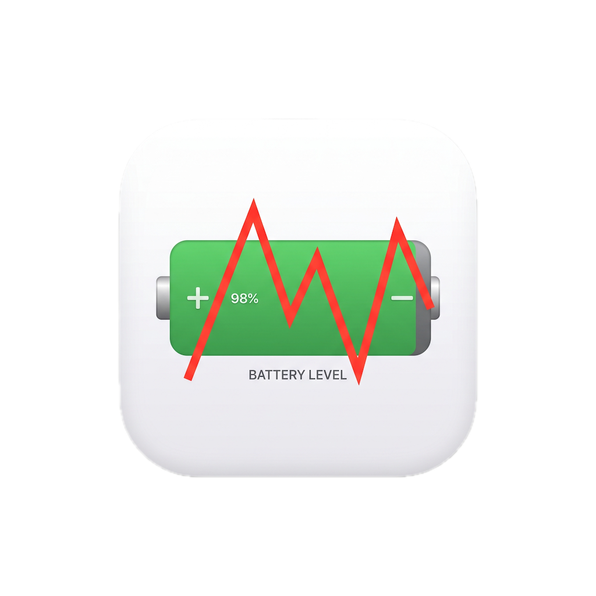
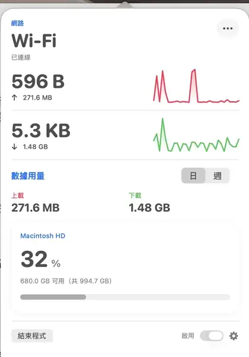
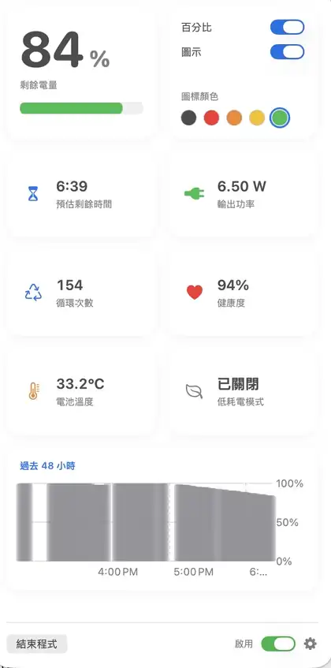

# MyNetBatt

<p align="center">
  
</p>

MyNetBatt 是一款原生 macOS 選單列系統監控工具，將電池、網路與系統效能資訊集中在簡潔的 SwiftUI 介面中。

> 目前版本：3.0 · 介面語言：繁體中文

## Screenshots

<p align="center">
  
  &nbsp;
  
</p>

<p align="center">
  Network & system monitoring · Battery health & power monitoring
</p>

## 開發狀態

MyNetBatt 目前持續開發與維護中，專案完整原始碼以 MIT License 公開，歡迎社群回報問題、提出功能建議或提交 pull request。

- 原生 Swift / SwiftUI macOS 應用程式
- Apple Silicon 為主要開發與測試平台
- 提供可自行建置的 Xcode project
- 包含具簽章驗證與最小權限設計的 Privileged Helper
- 監控資料主要於本機處理與儲存，不包含分析 SDK、廣告 SDK 或使用者追蹤服務

## 功能

- 選單列顯示電池圖示、電量百分比、即時網路速度與流量圖表
- 電池電量、充電狀態、健康度、循環次數、溫度、功率與 48 小時趨勢
- 透過受簽章的 Privileged Helper 切換 macOS 低耗電模式
- 網路上下載速度、累計流量、介面、區域 IP、閘道、DNS 與公網 IP
- 每個 App／程序的日、週網路用量統計
- CPU、GPU、記憶體、Swap 與儲存空間監控
- Thunderbolt、USB4 與 USB 裝置資訊
- 睡眠喚醒後自動重新整理監控資料
- 支援登入時自動啟動

## 系統需求

- macOS 26.5 或更新版本
- Apple Silicon Mac（目前專案以 `arm64` 開發與測試）
- Xcode 26 或更新版本

## 從原始碼建置

1. Clone repository：

   ```bash
   git clone https://github.com/stone5202/MyNetBatt.git
   cd MyNetBatt
   ```

2. 使用 Xcode 開啟：

   ```bash
   open MyNetBatt/MyNetBatt.xcodeproj
   ```

3. 在 `MyNetBatt` 與 `MyNetBattPrivilegedHelper` targets 選擇你的 Development Team。
4. 如需使用自己的簽章與 bundle identifier，請同步更新：

   - Xcode project 的 `PRODUCT_BUNDLE_IDENTIFIER` 與 `DEVELOPMENT_TEAM`
   - `MyNetBatt/MyNetBatt/PrivilegedHelperProtocol.swift`
   - `MyNetBatt/PrivilegedHelper/HelperProtocol.swift`

5. 選擇 `MyNetBatt` scheme 後 Build & Run。

也可以從命令列建置：

```bash
xcodebuild \
  -project MyNetBatt/MyNetBatt.xcodeproj \
  -scheme MyNetBatt \
  -configuration Debug \
  -destination 'platform=macOS,arch=arm64' \
  build
```

## Privileged Helper

macOS 的低耗電模式需要管理員權限。MyNetBatt 第一次安裝或修復 helper 時會顯示系統管理員授權視窗，之後切換低耗電模式不需要重複輸入密碼。

Helper 只公開讀取及切換低耗電模式的方法，不接受任意 shell command、路徑或參數。主程式與 helper 會互相驗證 signing identifier 與 Team ID。完整設計請參閱 [Privileged Helper 文件](docs/PRIVILEGED_HELPER_SETUP.md)。

## 隱私與網路連線

- 電池歷史、App 網路用量與介面設定儲存在本機 `UserDefaults`。
- MyNetBatt 不包含分析 SDK、廣告 SDK 或使用者追蹤服務。
- 顯示公網 IP 時，程式會向 [`https://api.ipify.org`](https://api.ipify.org) 發出請求；該服務會自然接收到請求來源 IP。
- 其他硬體與系統資訊來自 macOS 內建 API 與命令列工具。

## 專案結構

```text
MyNetBatt/
├── MyNetBatt/                 # 主程式 SwiftUI views 與系統監控
├── PrivilegedHelper/          # 低耗電模式 XPC helper
└── MyNetBatt.xcodeproj/       # Xcode project
docs/
└── PRIVILEGED_HELPER_SETUP.md
```

## Roadmap

目前規劃持續改善下列項目：

- 擴充系統與硬體監控資訊，並改善不同 Apple Silicon 機型的相容性
- 強化網路流量與每個 App／程序的統計與歷史資料呈現
- 增加自動化測試與建置驗證，提高版本更新的可靠性
- 持續檢視 Privileged Helper 的安全邊界、簽章驗證與最小權限設計
- 改善文件、除錯資訊與 issue / pull request 開發流程
- 評估以 AI 輔助程式碼分析、測試、文件與維護工作的開源開發流程

Roadmap 會依 macOS 更新、使用者回饋與實際開發進度調整。若有功能建議，歡迎透過 GitHub issue 討論。

## 參與開發

歡迎提交 issue 或 pull request。送出變更前，請確認：

- 專案能以目前的 `MyNetBatt` scheme 成功建置
- 不提交 `xcuserdata`、`.DS_Store`、DerivedData 或其他本機產物
- 修改 helper 識別碼或簽章規則時，同步更新主程式、helper 與文件

## License

本專案採用 [MIT License](LICENSE)。
